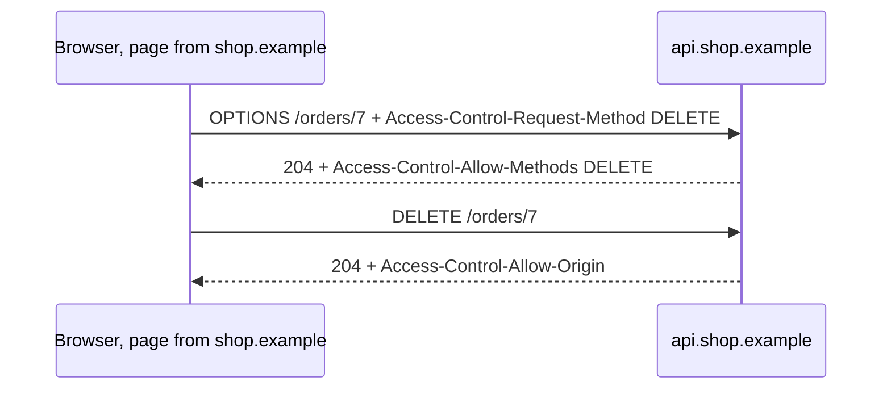
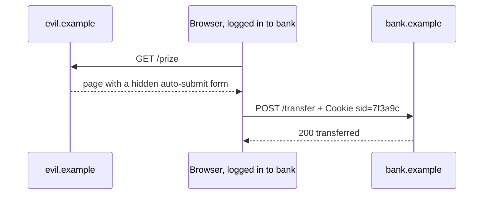

<p class="course">مهندسی اینترنت، فصل ۱: پروتکل‌ها</p>

# state و هویت

<p class="lede">جلسهٔ ۳: کوکی و SOP و CORS و CSRF؛ پروتکلی که بی‌حالت است، شما را چطور می‌شناسد؟</p>

<Chain :today="['http']" />

<p class="byline">محمد بصیرزاده<br>دانشگاه شهید چمران اهواز، دانشکدهٔ مهندسی، پاییز ۱۴۰۵</p>

---
type: interactive
module: M0
minutes: 3
link: http
corner: نگاهی از دور
---

# سرور چطور بفهمد دو درخواست از یک نفر است؟

شمارندهٔ بازدید تمرین ۲ کوکی نداشت و دو دانشجو پشت یک مودم خوابگاه را یک نفر شمرد. سرور برای شناختن هر کاربر به چه چیزی تکیه کند؟

<ol class="options">
  <li><b>الف)</b> نشانی IP</li>
  <li><b>ب)</b> IP و نام مرورگر</li>
  <li v-mark.box.orange="1"><b>ج)</b> برچسب خودش</li>
  <li><b>د)</b> پورت TCP</li>
</ol>

<div v-click="1" class="answer"><strong>پاسخ: ج)</strong> نشانی IP میان دستگاه‌های پشت یک مودم مشترک است و با رفتن به شبکهٔ همراه عوض می‌شود؛ <code>User-Agent</code> میان میلیون‌ها مرورگر یکی است؛ پورت با هر اتصال عوض می‌شود. فقط مقداری که سرور خودش به همان مرورگر داده، آن را یکتا می‌کند.</div>

::punch::

<div v-click="1">پروتکل هر درخواست را جدا می‌بیند؛ پیوستگی را برنامه می‌سازد.</div>

---
module: M0
minutes: 2
link: http
corner: نگاهی از دور
---

# نگاهی از دور: چهار پرسش دربارهٔ هویت

<div class="proto">
  <div class="proto-end">مرورگر<small>و هر صفحه‌ای که در آن باز است</small></div>
  <ol class="proto-steps">
    <li><b>به یاد آوردن</b><span>cookie</span></li>
    <li><b>خواندن</b><span>SOP + CORS</span></li>
    <li><b>فرستادن</b><span>CSRF + SameSite</span></li>
    <li><b>شناختن</b><span>401 + token</span></li>
  </ol>
  <div class="proto-end">سرور<small>هر درخواست را جدا می‌بیند</small></div>
</div>

- خودِ HTTP [بی‌حالت]{.mark} است: هر درخواست به‌تنهایی معنای کامل دارد ([RFC 9110 §3.3](https://www.rfc-editor.org/rfc/rfc9110#section-3.3))
- برنامه‌ها ولی state دارند: ورود، سبد خرید، تنظیمات. امروز می‌بینیم این state از کجا می‌آید و با خودش چه خطرهایی می‌آورد

::punch::

پروتکل بی‌حالت است، برنامه نه؛ فاصلهٔ این دو را کوکی پر می‌کند.

---
layout: section
type: section
module: M1
minutes: 0
link: http
---

# کوکی: برچسبی که مرورگر پس می‌فرستد

<p class="since">تمرین ۲ نشان داد سرور از روی IP و header‌ها نمی‌تواند کاربر را یکتا بشناسد.</p>

<p class="question">سرور چه چیزی به مرورگر بدهد تا درخواست بعدی را به قبلی وصل کند، و چه کسانی آن را می‌بینند؟</p>

---
module: M1
minutes: 2
link: http
corner: کوکی
---

# سرور چطور درخواست دوم را به اولی وصل می‌کند؟

<HttpMsg :lines="[
  { t: 'HTTP/1.1 200 OK', l: 'پاسخ ورود', c: 3 },
  { t: 'Set-Cookie: sid=7f3a9c; Path=/; HttpOnly', l: 'برچسب سرور', c: 4 },
]" />

<HttpMsg :lines="[
  { t: 'GET /cart HTTP/1.1', l: 'درخواست بعدی', c: 2 },
  { t: 'Cookie: sid=7f3a9c', l: 'همان برچسب', c: 4 },
]" />

- مرورگر [کوکی](https://www.rfc-editor.org/rfc/rfc6265) را نگه می‌دارد و در [هر درخواست بعدی به همان مقصد]{.mark} خودکار پس می‌فرستد
- attribute‌هایی مثل `Path` و `HttpOnly` دستور به مرورگرند و به سرور برنمی‌گردند

::punch::

کوکی برچسبی است که سرور می‌چسباند و مرورگر خودکار نشانش می‌دهد.

---
module: M1
minutes: 2
link: http
corner: کوکی
---

# در کوکی چه بگذاریم: شناسه یا خودِ داده؟

| | شناسهٔ نشست | دادهٔ امضاشده، مثل [JWT](https://www.rfc-editor.org/rfc/rfc7519) |
| --- | --- | --- |
| state کجاست | در سرور؛ کوکی فقط یک عدد تصادفی است | در خود کوکی؛ سرور فقط امضا را می‌سنجد |
| خروج و ابطال | سرور رکورد را پاک می‌کند؛ [فوری]{.mark} | تا لحظهٔ انقضا معتبر می‌ماند |
| هزینه | یک جستجو در هر درخواست؛ حافظهٔ مشترک میان سرورها | بی‌جستجو؛ ولی کوکی بزرگ‌تر در هر درخواست |

<p class="small">JWT یک شیء JSON است که سرور امضایش کرده؛ هر کس آن را دارد می‌تواند محتوایش را بخواند، ولی نمی‌تواند عوضش کند.</p>

::punch::

هرچه state را به کلاینت بسپارید، پس گرفتنش سخت‌تر می‌شود.

---
module: M1
minutes: 2
link: http
corner: کوکی
---

# هر attribute به چه پرسشی جواب می‌دهد؟

| attribute | پرسش |
| --- | --- |
| `Domain` و `Path` | به کدام مقصدها فرستاده شود؟ |
| `Expires` و `Max-Age` | تا کِی بماند؟ بدون این‌ها، با بستن مرورگر پاک می‌شود |
| `Secure` | فقط روی HTTPS فرستاده شود (جلسهٔ ۴) |
| `HttpOnly` | JavaScript صفحه آن را [نبیند]{.mark}؛ معنایش «فقط روی HTTP» نیست |
| `SameSite` | همراه درخواستی که از سایت دیگری شروع شده هم برود؟ (بخش ۳) |

<p class="small">تعریف‌ها در <a href="https://developer.mozilla.org/en-US/docs/Web/HTTP/Reference/Headers/Set-Cookie">MDN: Set-Cookie</a> و پیش‌نویس <a href="https://datatracker.ietf.org/doc/draft-ietf-httpbis-rfc6265bis/">6265bis</a>؛ <code>SameSite</code> در RFC 6265 نیست.</p>

::punch::

هر attribute خودکار بودن کوکی را تنگ‌تر می‌کند: به کجا، تا کِی، روی چه اتصالی، و برای چه کسی.

---
type: interactive
module: M1
minutes: 3
link: http
corner: کوکی
---

# کوکی سامانهٔ درس به کدام سایت‌های دانشگاه می‌رسد؟

پاسخ ورود `lms.scu.ac.ir` این خط را دارد: `Set-Cookie: sid=7f3a9c; Domain=scu.ac.ir; Secure`

<ol class="options">
  <li><b>الف)</b> فقط <code>lms</code></li>
  <li><b>ب)</b> <code>lms</code> و <code>www</code></li>
  <li v-mark.box.orange="1"><b>ج)</b> همهٔ زیردامنه‌ها</li>
  <li><b>د)</b> همهٔ <code>ac.ir</code></li>
</ol>

<div v-click="1" class="answer"><strong>پاسخ: ج)</strong> با <code>Domain</code> کوکی به همهٔ زیردامنه‌ها می‌رود، حتی وبلاگی ناامن روی <code>blog.scu.ac.ir</code>. بدون آن، فقط به همان host برمی‌گردد. پیشوند <code>__Host-</code> در نام کوکی مرورگر را وادار می‌کند همین را تضمین کند.</div>

::punch::

<div v-click="1">نوشتن <code>Domain</code> دامنهٔ کوکی را گشادتر می‌کند، نه تنگ‌تر؛ ننویسید.</div>

---
module: M1
minutes: 2
link: http
corner: کوکی
---

# سناریوی واقعی: فایلی که برای پشتیبانی فرستاده شد

- مهر ۱۴۰۲: مهاجمان از سامانهٔ پشتیبانی Okta، شرکت مدیریت هویت، فایل‌های HAR مشتریان را برداشتند
- فایل HAR ضبط کامل ترافیک مرورگر است، [با همهٔ کوکی‌ها و token‌های نشست]{.mark}
- با همان‌ها، بی‌رمز و بی‌عامل دوم، وارد نشست مدیران Cloudflare و چند شرکت دیگر شدند ([Cloudflare](https://blog.cloudflare.com/introducing-har-sanitizer-secure-har-sharing/))
- دفاع: نشست کوتاه‌عمر و ابطال در سرور؛ و از بهار ۱۴۰۵ Chrome روی Windows نشست را به کلیدی در تراشهٔ امنیتی دستگاه گره می‌زند ([DBSC](https://www.bleepingcomputer.com/news/security/google-chrome-adds-session-cookie-theft-protection-for-all-users/))

::punch::

هر که کوکی نشست را داشته باشد، برای سرور خودِ شماست.

---
type: demo
module: M1
minutes: 6
link: http
corner: کوکی
lab: 03-state-identity/bank
status: executed
---

# کوکی را با دست جابه‌جا کنیم

<dl class="run">
  <dt>سؤال</dt><dd>سرور از کجا می‌فهمد درخواست دوم از همان کاربر است؟ اگر کوکی را به کلاینت دیگری ببریم چه می‌شود؟</dd>
  <dt>مشاهده</dt><dd>پاسخ <code>/me</code> بدون کوکی، با cookie jar، و با کوکی‌ای که دستی در header نوشته‌ایم</dd>
  <dt>تصمیم</dt><dd>کوکی نشست را مثل رمز عبور نگه دار: <code>HttpOnly</code>، عمر کوتاه، ابطال در سرور</dd>
</dl>

```sh
curl -si -c jar.txt -d 'user=ali' 'http://localhost:8771/login?samesite=lax'
curl -s  -b jar.txt http://localhost:8771/me
curl -s  -H 'Cookie: sid=<value from jar.txt>' http://localhost:8771/me
```

<p class="status">سرور محلی در <code>labs/03-state-identity/bank</code>. همین کوکی را در مرورگر هم ببینید: DevTools، زبانهٔ Application، بخش Cookies.</p>

---
type: reserve
module: M1
minutes: 0
link: http
corner: کوکی
---

# خروجی دمو: یک کوکی، دو کلاینت

```text
GET  /me                               401  not logged in
POST /login?samesite=lax               200  Set-Cookie: sid=6e098d9b60d7b5f8;
                                            Path=/; HttpOnly; SameSite=Lax
GET  /me   -b jar.txt                  200  user=ali balance=1000
GET  /me   -H 'Cookie: sid=6e09…'      200  user=ali balance=1000
POST /logout  -b jar.txt               200  bye
GET  /me   -H 'Cookie: sid=6e09…'      401  not logged in
```

- سرور کلاینت دوم را از اولی تشخیص نداد: [فقط مقدار کوکی را می‌بیند]{.mark}
- بعد از `/logout` سرور رکورد نشست را پاک کرد و همان مقدار دیگر کار نکرد؛ این مزیت شناسهٔ سمت سرور است

---
module: M1
minutes: 2
link: http
corner: کوکی
lead: "تا اینجا کوکی را سایتی گذاشت که خودتان باز کرده بودید؛ ولی هر صفحه از سایت‌های دیگر هم تصویر و اسکریپت بار می‌کند."
---

# چه کسی شما را از سایتی به سایت دیگر دنبال می‌کند؟

- صفحهٔ `news.example` تصویری از `ads.example` دارد و مرورگر کوکی `ads.example` را همراه آن درخواست می‌فرستد؛ این [کوکی شخص ثالث]{.mark} در هزاران سایت یکی است
- Safari از ۱۳۹۹ آن را می‌بندد و Firefox از ۱۴۰۱ برای هر سایت جدا نگهش می‌دارد
- Chrome در ۱۳۹۸ وعدهٔ حذف داد، در [اردیبهشت ۱۴۰۴](https://privacysandbox.google.com/blog/privacy-sandbox-next-steps) منصرف شد و در [مهر ۱۴۰۴](https://privacysandbox.google.com/blog/update-on-plans-for-privacy-sandbox-technologies) بیشتر جایگزین‌هایش را بازنشسته کرد

::punch::

کوکی به مقصد درخواست تعلق دارد، نه به صفحه‌ای که باز است.

---
layout: section
type: section
module: M2
minutes: 0
link: http
---

# مرز خواندن: SOP و CORS

<p class="since">مرورگر کوکی را خودکار به مقصدش می‌فرستد، از هر صفحه‌ای که درخواست شروع شده باشد.</p>

<p class="question">اگر هر صفحه‌ای می‌تواند به بانک شما درخواست بفرستد، چه چیزی جلوی خواندن حسابتان را می‌گیرد؟</p>

---
module: M2
minutes: 2
link: http
corner: SOP
---

# SOP جلوی چه چیزی را می‌گیرد، و جلوی چه چیزی را نه؟

| کاری که صفحهٔ `evil.example` با `bank.example` می‌کند | مجاز است؟ |
| --- | --- |
| فرستادن درخواست با `<form>` یا `` یا `fetch` | بله |
| جاسازی تصویر و اسکریپت و iframe آن | بله؛ ولی اسکریپت محتوایش را نمی‌بیند |
| [خواندن پاسخ]{.mark} با JavaScript | نه، مگر سرور اجازه دهد |
| خواندن کوکی و DOM آن origin | نه |

<p class="small">در جلسهٔ ۱ دیدیم origin سه‌تایی scheme و host و port است. <a href="https://developer.mozilla.org/en-US/docs/Glossary/Same-origin_policy">Same-Origin Policy</a> قاعدهٔ مرورگر دربارهٔ همین مرز است.</p>

::punch::

SOP خواندن را می‌بندد، نه فرستادن را.

---
type: interactive
module: M2
minutes: 3
link: http
corner: SOP
---

# اسکریپت سایت دیگر موجودی شما را می‌خواهد؛ چه می‌شود؟

در `bank.example` وارد شده‌اید. اسکریپت `evil.example` اجرا می‌کند: `fetch('https://bank.example/balance')`

<ol class="options">
  <li><b>الف)</b> فرستاده نمی‌شود</li>
  <li v-mark.box.orange="1"><b>ب)</b> فقط می‌رسد</li>
  <li><b>ج)</b> سرور رد می‌کند</li>
  <li><b>د)</b> خوانده می‌شود</li>
</ol>

<div v-click="1" class="answer"><strong>پاسخ: ب)</strong> این GET فرستاده و در سرور پردازش می‌شود. مرورگر پاسخ را می‌گیرد، ولی چون اجازهٔ CORS در آن نیست، به اسکریپت فقط خطا می‌دهد. اینکه کوکی هم همراهش می‌رود یا نه، موضوع بخش ۳ است.</div>

::punch::

<div v-click="1">درخواست به سرور رسید و اجرا شد؛ فقط خواندن پاسخ بسته ماند.</div>

---
module: M2
minutes: 2
link: http
corner: CORS
---

# سرور چطور به origin دیگری اجازهٔ خواندن می‌دهد؟

<div class="cols">
<div>

- مرورگر در درخواست بین‌مبدأ فیلد `Origin` را می‌گذارد؛ اسکریپت صفحه نمی‌تواند آن را عوض کند
- اگر پاسخ `Access-Control-Allow-Origin` با همان origin داشت، مرورگر [پاسخ را به اسکریپت می‌دهد]{.mark}
- برای درخواست با کوکی، `Access-Control-Allow-Credentials: true` هم لازم است و مقدار `*` پذیرفته نمی‌شود

</div>

```http
GET /api/cart HTTP/1.1
Host: api.shop.example
Origin: https://shop.example

HTTP/1.1 200 OK
Access-Control-Allow-Origin:
    https://shop.example
Vary: Origin
```

</div>

<p class="small">نام این سازوکار <a href="https://developer.mozilla.org/en-US/docs/Web/HTTP/Guides/CORS">CORS</a> است و در <a href="https://fetch.spec.whatwg.org/#http-cors-protocol">استاندارد Fetch</a> تعریف شده، نه در RFC‌های HTTP.</p>

::punch::

CORS دیوار نیست، دریچه است: استثنایی که سرور روی SOP باز می‌کند.

---
module: M2
minutes: 2
link: http
corner: CORS
---

# چرا مرورگر گاهی پیش از درخواست اجازه می‌گیرد؟



- درخواستی که از یک فرم HTML برنمی‌آید، اول با `OPTIONS` [اجازه می‌گیرد]{.mark}؛ نام این پرسش [preflight](https://developer.mozilla.org/en-US/docs/Glossary/Preflight_request) است

::punch::

preflight از سرورهایی محافظت می‌کند که انتظار چنین درخواستی را نداشتند.

---
type: interactive
module: M2
minutes: 3
link: http
corner: CORS
---

# کدام درخواست‌ها preflight می‌خواهند؟

صفحه‌ای از `evil.example` این چهار درخواست را به `api.shop.example` می‌فرستد:

<div class="urls">
  <code>1  GET /items</code>
  <code>2  POST /pay   (HTML form body)</code>
  <code>3  POST /pay   (JSON body)</code>
  <code>4  DELETE /items/7</code>
</div>

<ol class="options">
  <li><b>الف)</b> هیچ‌کدام</li>
  <li><b>ب)</b> فقط ۴</li>
  <li v-mark.box.orange="1"><b>ج)</b> ۳ و ۴</li>
  <li><b>د)</b> ۲ و ۳ و ۴</li>
</ol>

<div v-click="1" class="answer"><strong>پاسخ: ج)</strong> اولی و دومی را فرم HTML هم می‌سازد؛ پس بی‌اجازه فرستاده و در سرور اجرا می‌شوند. بدنهٔ JSON و متد <code>DELETE</code> از فرم برنمی‌آید و مرورگر اول می‌پرسد.</div>

::punch::

<div v-click="1">هرچه از فرم HTML برمی‌آید بی‌اجازه به سرور شما می‌رسد؛ دفاعش با شماست.</div>

---
type: demo
module: M2
minutes: 5
link: http
corner: CORS
lab: 03-state-identity/cors
status: executed
---

# آیا CORS جلوی رسیدن درخواست را می‌گیرد؟

<dl class="run">
  <dt>سؤال</dt><dd>اگر origin درخواست مجاز نباشد، سرور آن را اجرا می‌کند یا نه؟</dd>
  <dt>مشاهده</dt><dd>پاسخ سرور به GET و POST از <code>https://evil.example</code>، و موجودی بعد از آن</dd>
  <dt>تصمیم</dt><dd>CORS جای کنترل دسترسی سرور را نمی‌گیرد؛ هر عملیات باید خودش هویت و اجازه را بسنجد</dd>
</dl>

```sh
U=http://127.0.0.1:8773/api
curl -si -H 'Origin: https://evil.example' $U/balance
curl -si -X POST -H 'Origin: https://evil.example' $U/transfer
curl -s $U/balance
```

<p class="status">سرور محلی در <code>labs/03-state-identity/cors</code>. curl مرورگر نیست و SOP ندارد؛ فیلد <code>Origin</code> را خودمان می‌نویسیم.</p>

---
type: reserve
module: M2
minutes: 0
link: http
corner: CORS
---

# خروجی دمو: سرور چه کرد، و مرورگر چه می‌کرد؟

| درخواست | پاسخ سرور | مرورگر با آن چه می‌کرد |
| --- | --- | --- |
| GET از `app.example` (مجاز) | `200` با `Access-Control-Allow-Origin` | پاسخ را به اسکریپت می‌دهد |
| GET از `evil.example` | `200` با همان بدنه، بدون آن فیلد | پاسخ را به اسکریپت نمی‌دهد |
| preflight برای DELETE از `evil.example` | `204` بدون `Access-Control-Allow-Methods` | DELETE را نمی‌فرستد |
| POST از `evil.example` | `200`؛ [موجودی از ۱۰۰۰ به ۹۰۰ رسید]{.mark} | پاسخ را نمی‌دهد؛ ولی کار انجام شده |

- در همهٔ پاسخ‌ها `Vary: Origin` هست تا یک cache، پاسخ یک origin را به دیگری ندهد (جلسهٔ ۵)

---
module: M2
minutes: 2
link: http
corner: CORS
---

# سناریوی واقعی: سروری که هر Origin را تأیید می‌کرد

- بعضی سرورها برای راحتی، مقدار `Origin` درخواست را عیناً در `Access-Control-Allow-Origin` [بازتاب می‌دهند]{.mark} و `Access-Control-Allow-Credentials: true` هم می‌فرستند
- در پژوهشی در [مهر ۱۳۹۵](https://portswigger.net/research/exploiting-cors-misconfigurations-for-bitcoins-and-bounties)، با همین خطا کلید API کاربران یک صرافی بیت‌کوین از صفحه‌ای بیگانه خوانده می‌شد؛ با آن کلید می‌شد دارایی را منتقل کرد
- صرافی دیگری origin را با «شروع می‌شود با» می‌سنجید و `https://btc.net.evil.net` را هم می‌پذیرفت؛ همان خطای تمرین ۱

::punch::

اجازهٔ CORS را از یک فهرست دقیق بدهید؛ هرگز از روی خودِ درخواست.

---
layout: section
type: section
module: M3
minutes: 0
link: http
---

# جعل درخواست: CSRF و SameSite

<p class="since">خواندن پاسخ بسته است؛ ولی فرستادن آزاد است، و کوکی خودکار همراه درخواست می‌رود.</p>

<p class="question">اگر صفحهٔ دیگری به نام شما درخواست بفرستد، سرور از کجا بفهمد؟</p>

---
module: M3
minutes: 2
link: http
corner: CSRF
---

# وقتی صفحهٔ دیگری با کوکی شما درخواست می‌فرستد



- نام این حمله [CSRF](https://developer.mozilla.org/en-US/docs/Glossary/CSRF) است؛ مهاجم پاسخ را نمی‌بیند، ولی [اثر درخواست]{.mark} برایش کافی است

::punch::

سرور فقط کوکی را می‌بیند؛ نمی‌داند درخواست را چه کسی خواسته است.

---
module: M3
minutes: 2
link: http
corner: CSRF
---

# سناریوی واقعی: انتقال پول با باز کردن یک صفحه

- مهر ۱۳۸۷: دو پژوهشگر دانشگاه پرینستون نشان دادند در بانک اینترنتی ING Direct، صفحه‌ای بیگانه می‌تواند به نام کاربرِ واردشده [حساب تازه بسازد و پول منتقل کند]{.mark} ([Zeller و Felten](https://blog.citp.princeton.edu/2008/09/29/popular-websites-vulnerable-cross-site-request-forgery-attacks))
- در همان گزارش: در YouTube تقریباً هر کاری به نام کاربر شدنی بود، و سایت New York Times نشانی ایمیل کاربرانش را لو می‌داد
- در هیچ‌کدام رمزی دزدیده نشد و پاسخی خوانده نشد

::punch::

هر عملیاتی که فقط به کوکی تکیه کند، از هر صفحه‌ای در وب قابل‌اجراست.

---
module: M3
minutes: 2
link: http
corner: SameSite
---

# مرورگر کِی کوکی را همراه درخواست نمی‌فرستد؟

| درخواست به `bank.example` | `Strict` | `Lax` | `None` |
| --- | --- | --- | --- |
| از صفحه‌ای در خود `bank.example` | ✓ | ✓ | ✓ |
| کلیک روی لینک در سایت دیگر (GET سطح بالا) | ✗ | ✓ | ✓ |
| فرم POST یا `fetch` یا `` در سایت دیگر | ✗ | [✗]{.mark} | ✓ |

- attribute ‏[`SameSite`](https://developer.mozilla.org/en-US/docs/Web/HTTP/Reference/Headers/Set-Cookie#samesitesamesite-value) همین را تعیین می‌کند؛ `None` فقط همراه `Secure` پذیرفته می‌شود
- Chrome از بهمن ۱۳۹۸ کوکی بدون `SameSite` را `Lax` حساب می‌کند؛ دو ماه بعد، در همه‌گیری کرونا، [موقتاً عقب کشید](https://blog.chromium.org/2020/04/temporarily-rolling-back-samesite.html) تا سایت‌های بانک و درمان نشکنند

::punch::

با `SameSite` کوکی فقط وقتی می‌رود که درخواست از خودِ سایت شروع شده باشد.

---
type: interactive
module: M3
minutes: 3
link: http
corner: SameSite
---

# کوکی Strict از یک زیردامنهٔ دیگر هم می‌رود؟

کوکی `bank.example.com` با `SameSite=Strict` است. مهاجم در `blog.example.com` فرمی می‌گذارد که به `bank.example.com/transfer` ارسال می‌شود.

<ol class="options">
  <li><b>الف)</b> نه؛ origin دیگر</li>
  <li v-mark.box.orange="1"><b>ب)</b> بله؛ هم‌سایت‌اند</li>
  <li><b>ج)</b> فقط با GET</li>
  <li><b>د)</b> فقط با <code>Domain</code></li>
</ol>

<div v-click="1" class="answer"><strong>پاسخ: ب)</strong> <code>SameSite</code> با site کار دارد: scheme و دامنهٔ قابل‌ثبت (جلسهٔ ۱). این دو زیردامنه هم‌سایت‌اند. پورت هم جزء site نیست: <code>localhost:3000</code> و <code>localhost:8000</code> یک site‌اند.</div>

::punch::

<div v-click="1"><code>SameSite</code> مرز site را می‌کشد، نه origin را.</div>

---
type: demo
module: M3
minutes: 6
link: http
corner: CSRF
lab: 03-state-identity/bank
status: executed
---

# CSRF را روی بانک آزمایشی ببینیم

<dl class="run">
  <dt>سؤال</dt><dd>با هر مقدار <code>SameSite</code>، فرم پنهان صفحهٔ مهاجم موفق می‌شود یا نه؟</dd>
  <dt>مشاهده</dt><dd>موجودی حساب، پیش و پس از باز کردن صفحهٔ مهاجم: یک بار از <code>127.0.0.1:8772</code> (سایت دیگر) و یک بار از <code>localhost:8772</code> (همان سایت، پورت دیگر)</dd>
  <dt>تصمیم</dt><dd><code>SameSite</code> را صریح بنویس، و به آن تنها تکیه نکن</dd>
</dl>

```sh
node bank/bank.mjs     # bank:  http://localhost:8771
node bank/evil.mjs     # evil:  http://127.0.0.1:8772/post   http://localhost:8772/post
```

<p class="status">در مرورگر در بانک وارد شوید، مقدار <code>SameSite</code> را از فهرست فرم انتخاب کنید، صفحهٔ مهاجم را باز کنید و به بانک برگردید. کد در <code>labs/03-state-identity/bank</code>.</p>

---
type: reserve
module: M3
minutes: 0
link: http
corner: CSRF
---

# خروجی دمو: کوکی همراه کدام درخواست رفت؟

| کوکی نشست | POST از سایت دیگر | POST از `localhost:8772` | `` از سایت دیگر | لینک از سایت دیگر |
| --- | --- | --- | --- | --- |
| بدون `SameSite` | [رفت]{.mark} | رفت | نرفت | رفت |
| `Lax` | نرفت | رفت | نرفت | رفت |
| `Strict` | نرفت | [رفت]{.mark} | نرفت | نرفت |
| `None; Secure` | رفت | رفت | رفت | رفت |

- سطر اول مثل `Lax` نیست: Chromium تا [دو دقیقه](https://www.chromium.org/updates/same-site/faq/) پس از ساخته شدن کوکیِ بدون `SameSite`، POST سطح بالا از سایت دیگر را هم مجاز می‌داند
- ستون دوم: پورت دیگر، ولی همان site. اجراشده با Chromium 141 و `bank/auto.mjs`

---
module: M3
minutes: 2
link: http
corner: CSRF
---

# تصمیم: Lax یا Strict، و چه چیزی کنارش؟

| لایهٔ دفاع ([OWASP](https://cheatsheetseries.owasp.org/cheatsheets/Cross-Site_Request_Forgery_Prevention_Cheat_Sheet.html)) | چه می‌کند | کجا کم می‌آورد |
| --- | --- | --- |
| `SameSite=Lax` صریح | کوکی از فرم سایت دیگر نمی‌رود | زیردامنهٔ هم‌سایت |
| `SameSite=Strict` | با لینک سایت دیگر هم نمی‌رود | لینک ایمیل: کاربر «واردنشده» |
| token ضد CSRF در فرم | صفحهٔ بیگانه [آن را نمی‌خواند]{.mark} | فراموش شدن در یک فرم |
| بررسی [`Sec-Fetch-Site`](https://developer.mozilla.org/en-US/docs/Web/HTTP/Reference/Headers/Sec-Fetch-Site) | سرور مبدأ درخواست را می‌بیند | کلاینت قدیمی نمی‌فرستد |

::punch::

`Lax` برای نشست، یک دفاع دوم در سرور، و هیچ تغییری با GET.

---
module: M3
minutes: 2
link: http
corner: هوش مصنوعی
---

# پیوند با هوش مصنوعی: agentی که با کوکی‌های شما مرور می‌کند

- مرورگرهای دارای agent به‌جای شما می‌خوانند و کلیک می‌کنند، [با همهٔ نشست‌های واردشدهٔ شما]{.mark}
- مرداد ۱۴۰۴، مرورگر Comet: دستوری پنهان در یک نظر Reddit کافی بود تا agent نشانی ایمیل کاربر و رمز یک‌بارمصرفش را از Gmail بردارد و منتشر کند ([Brave](https://brave.com/blog/comet-prompt-injection/))
- SOP و CORS و `SameSite` فرض می‌کنند مهاجم یک «صفحه» است؛ agent برای مرورگر خودِ کاربر است

::punch::

دفاع‌های مرورگر جلوی اسکریپت بیگانه را می‌گیرند، نه جلوی نمایندهٔ خودتان.

---
layout: section
type: section
module: M4
minutes: 0
link: http
---

# احراز هویت از دور

<p class="since">کوکی می‌گوید «من همان قبلی‌ام»؛ نمی‌گوید آن قبلی که بود.</p>

<p class="question">بار اول سرور از کجا بفهمد شما کیستید، و کلاینتی که مرورگر نیست چه کند؟</p>

---
module: M4
minutes: 2
link: http
corner: احراز هویت
---

# سرور چطور می‌پرسد «تو کیستی»؟

<div class="cols">
<div>

- چارچوب خودِ HTTP: `401` با یک چالش در `WWW-Authenticate`، و مدرک کلاینت در `Authorization` ([RFC 9110 §11](https://www.rfc-editor.org/rfc/rfc9110#section-11))
- طرح `Basic` نام و رمز را فقط با Base64 می‌نویسد؛ [رمزنگاری نیست]{.mark}
- طرح `Bearer` یک token می‌برد: هر که آن را بیاورد پذیرفته می‌شود ([RFC 6750](https://www.rfc-editor.org/rfc/rfc6750))
- کد `403` یعنی شناختمت ولی اجازه نداری (جلسهٔ ۲)

</div>

```http
GET /grades HTTP/1.1

HTTP/1.1 401 Unauthorized
WWW-Authenticate: Bearer

GET /grades HTTP/1.1
Authorization: Bearer eyJhbGci…
```

</div>

::punch::

کوکی و `Authorization` دو راه برای بردن یک چیزند: مدرکی که سرور قبلاً به شما داده است.

---
module: M4
minutes: 2
link: http
corner: احراز هویت
---

# session cookie یا bearer token؟

| | کوکی نشست | bearer token |
| --- | --- | --- |
| چه کسی به درخواست می‌چسباند | مرورگر، خودکار | کد شما، صریح |
| CSRF | [خطر دارد]{.mark}؛ دفاع بخش ۳ | ندارد؛ صفحهٔ بیگانه token را ندارد |
| دزدی با اسکریپت تزریق‌شده (XSS) | با `HttpOnly` خوانده نمی‌شود | اگر JavaScript ببیندش، برده می‌شود |
| کلاینت غیرمرورگر، مثل curl و agent | دست‌وپاگیر | طبیعی |

::punch::

برای مرورگر و سایت خودتان کوکی؛ برای ماشین‌ها و API عمومی token.

---
type: interactive
module: M4
minutes: 3
link: http
corner: احراز هویت
---

# token را در مرورگر کجا نگه داریم؟

برنامهٔ تک‌صفحه‌ای شما بعد از ورود یک token می‌گیرد، و یکی از کتابخانه‌های npm صفحه آلوده است.

<ol class="options">
  <li><b>الف)</b> <code>localStorage</code></li>
  <li><b>ب)</b> <code>sessionStorage</code></li>
  <li v-mark.box.orange="1"><b>ج)</b> کوکی <code>HttpOnly</code></li>
  <li><b>د)</b> در query نشانی</li>
</ol>

<div v-click="1" class="answer"><strong>پاسخ: ج)</strong> اسکریپت آلوده هرچه را JavaScript ببیند می‌خواند و بیرون می‌فرستد. کوکی <code>HttpOnly</code> را نمی‌بیند: می‌تواند از همان صفحه درخواست بفرستد، ولی نشست را با خودش نمی‌برد (<a href="https://cheatsheetseries.owasp.org/cheatsheets/HTML5_Security_Cheat_Sheet.html">OWASP</a>).</div>

::punch::

<div v-click="1">چیزی که اسکریپت صفحهٔ شما بتواند بخواند، اسکریپت شخص دیگری هم می‌خواند.</div>

---
module: M4
minutes: 2
link: http
corner: احراز هویت
lead: "اسلاید بعد دربارهٔ agent است و به یک مفهوم نیاز دارد: مدرکی که به نمایندگی از شما به یک برنامه داده می‌شود."
---

# OAuth از دور: اجازه دادن، بدون دادن رمز

- مسئله: برنامه‌ای باید تقویم شما را بخواند، بی‌آنکه رمز حسابتان را داشته باشد
- در [OAuth](https://www.rfc-editor.org/rfc/rfc6749) شما نزد «سرور مجوز» وارد می‌شوید و برنامه یک token [محدود]{.mark} می‌گیرد: برای یک سرویس، با دامنهٔ اجازهٔ معین (scope) و عمر کوتاه
- برنامه آن را با `Authorization: Bearer` به API می‌برد؛ API رمز شما را نمی‌بیند
- «ورود با Google» همین است، با یک لایهٔ هویت روی آن؛ جزئیات در فصل بعد

::punch::

رمز عبور همه‌کاره است؛ token را می‌شود کوچک، کوتاه‌عمر و پس‌گرفتنی ساخت.

---
module: M4
minutes: 2
link: http
corner: هوش مصنوعی
---

# پیوند با هوش مصنوعی: agent با اجازهٔ چه کسی کار می‌کند؟

```http
HTTP/1.1 401 Unauthorized
WWW-Authenticate: Bearer resource_metadata=
    "https://mcp.example.com/.well-known/oauth-protected-resource"
```

- در [MCP](https://modelcontextprotocol.io/specification/2026-07-28/basic/authorization)، پروتکل اتصال agent به ابزار (جلسهٔ ۷)، سرور ابزار همان `401` را می‌فرستد، با نشانی سندی که می‌گوید token را از کجا بگیر ([RFC 9728](https://www.rfc-editor.org/rfc/rfc9728))
- token باید [فقط برای همان سرور]{.mark} صادر شده باشد و در `Authorization` بیاید، نه در query

::punch::

پروتکل تازه چارچوب تازه نساخت؛ همان `401` دههٔ ۱۹۹۰ کافی بود.

---
module: M4
minutes: 2
link: http
corner: احراز هویت
---

# چرا رمز عبور دارد کنار می‌رود؟

- رمز عبور راز مشترک است: کاربر آن را در هر صفحه‌ای که شبیه سایت اصلی باشد تایپ می‌کند (homograph در جلسهٔ ۱)
- در [passkey](https://fidoalliance.org/passkeys/) کلید خصوصی در دستگاه می‌ماند و مرورگر هر امضا را به [origin همان صفحه]{.mark} گره می‌زند؛ امضای سایت جعلی به کار سایت اصلی نمی‌آید ([WebAuthn](https://www.w3.org/TR/webauthn-3/))
- سرور فقط کلید عمومی دارد، و بعد از ورود باز همان کوکی نشست ساخته می‌شود

::punch::

passkey فریب خوردن کاربر را بی‌اثر می‌کند: origin را مرورگر می‌سنجد، نه چشم کاربر.

---
layout: section
type: section
module: M5
minutes: 0
link: http
---

# جمع‌بندی

<p class="since">کوکی، مرز خواندن، جعل درخواست و احراز هویت را بررسی کردیم.</p>

<p class="question">برای نشست سامانهٔ درس دانشگاه، یک خط <code>Set-Cookie</code> درست چه شکلی است؟</p>

---
type: interactive
module: M5
minutes: 3
link: http
corner: جمع‌بندی
---

# کدام Set-Cookie برای نشست سامانهٔ درس درست است؟

<ol class="steps plain letters">
  <li><span><b>الف)</b> <code>sid=7f3a9c; Domain=scu.ac.ir; Secure</code></span></li>
  <li><span><b>ب)</b> <code>user=401234567; Max-Age=31536000; HttpOnly</code></span></li>
  <li v-mark.box.orange="1"><span><b>ج)</b> <code>__Host-sid=7f3a9c; Path=/; Secure; HttpOnly; SameSite=Lax</code></span></li>
  <li><span><b>د)</b> <code>sid=7f3a9c; HttpOnly; SameSite=None</code></span></li>
</ol>

<div v-click="1" class="answer" style="margin-top:6px"><strong>پاسخ: ج)</strong> الف به همهٔ زیردامنه‌ها می‌رود و JavaScript آن را می‌خواند. در ب، شمارهٔ دانشجویی جای شناسهٔ تصادفی نشسته و هر کس می‌تواند دانشجوی دیگری شود. د بدون <code>Secure</code> پذیرفته نمی‌شود.</div>

::punch::

<div v-click="1">هر جزء این خط جواب یکی از پرسش‌های امروز است.</div>

---
module: M5
minutes: 1
link: http
corner: جمع‌بندی
---

# چهار مدل ذهنی، چهار تصمیم

| مدل ذهنی | تصمیم مهندسی |
| --- | --- |
| کوکی برچسبی است که مرورگر خودکار پس می‌فرستد | شناسهٔ تصادفی در کوکی `__Host-` با `HttpOnly` |
| SOP خواندن را می‌بندد، نه فرستادن را | فهرست دقیق origin؛ کنترل دسترسی در سرور |
| کوکی همراه هر درخواست به مقصدش می‌رود | `SameSite=Lax` و یک دفاع دوم؛ بی‌تغییر با GET |
| کوکی را مرورگر می‌چسباند، token را کد شما | کوکی برای مرورگر، token برای ماشین |

::punch::

جلسهٔ بعد: کوکی در راه از چشم چه کسی پنهان می‌ماند؟ زیر HTTP چه می‌گذرد؟

---
type: exercise
module: M5
minutes: 4
link: http
corner: تمرین
---

# تمرین ۳: ورود با کوکی، و شکستن آن

<Exercise ex="03-cookie-csrf" due="تا شب پیش از جلسهٔ ۴">
<dl class="run">
  <dt>چالش</dt><dd>روی سرور محلی خودتان ورود با کوکی نشست بسازید. بعد از یک origin دیگر، با یک فرم پنهان، به نام کاربرِ واردشده پول منتقل کنید؛ و بعد جلویش را بگیرید.</dd>
  <dt>پیش‌بینی</dt><dd>همین حالا روی کاغذ: کوکی <code>SameSite=Strict</code> است و سرور شما روی <code>http://localhost:8000</code>. صفحهٔ مهاجم روی <code>http://localhost:9000</code> موفق می‌شود؟ روی <code>http://127.0.0.1:9000</code> چطور؟ چرا؟</dd>
  <dt>پل</dt><dd>کوکی شما در این تمرین روی HTTP بی‌رمز جابه‌جا می‌شود. جلسهٔ ۴ نشان می‌دهد چه کسی آن را می‌بیند و TLS چه چیزی را عوض می‌کند.</dd>
</dl>
</Exercise>

---
src: ../ch1-syllabus.md
type: core
module: M5
minutes: 1
---

---
type: extra
module: M5
minutes: 0
link: http
corner: جمع‌بندی
---

# برای کنجکاوی بیشتر (۱ از ۲)

<ol class="curious">
  <li>کوکی <code>Partitioned</code> چه مشکلی از کوکی شخص ثالث را حل می‌کند، و چرا بعد از بازنشستگی Privacy Sandbox ماند؟<span class="hint">دنبال CHIPS بگردید؛ کلید کوکی با سایتِ سطح بالا دوتایی می‌شود.</span></li>
  <li>چرا <code>fetch</code> با <code>mode: 'no-cors'</code> پاسخ را می‌گیرد، ولی نمی‌شود بدنه‌اش را خواند؟<span class="hint">«opaque response» در استاندارد Fetch.</span></li>
  <li>اسکریپت صفحه چرا نمی‌تواند فیلد <code>Sec-Fetch-Site</code> یا <code>Origin</code> را جعل کند؟<span class="hint">«forbidden request header» در استاندارد Fetch؛ پیشوند <code>Sec-</code> برای همین ساخته شد.</span></li>
</ol>

---
type: extra
module: M5
minutes: 0
link: http
corner: جمع‌بندی
---

# برای کنجکاوی بیشتر (۲ از ۲)

<ol class="curious" start="4" style="counter-reset: q 3">
  <li>اگر سایت شما روی <code>ali.github.io</code> باشد، با کوکی <code>Domain=github.io</code> چه می‌شود؟<span class="hint">بخش PRIVATE در Public Suffix List؛ با DevTools امتحانش کنید.</span></li>
  <li>چرا مرورگرها پس از حملهٔ Spectre، سندهای هر site را در پردازه‌ای جدا می‌گذارند، و SOP بدون آن چه کم داشت؟<span class="hint">Site Isolation در Chromium، و هدر <code>Cross-Origin-Opener-Policy</code>.</span></li>
  <li>نشستی که به کلید درون دستگاه گره خورده، در برابر بدافزاری که روی همان دستگاه اجرا می‌شود چه دفاعی دارد و چه دفاعی ندارد؟<span class="hint">مشخصات Device Bound Session Credentials در W3C؛ فرق «دزدیدن کوکی» با «استفاده از کوکی در همان دستگاه».</span></li>
</ol>

---
type: reserve
module: M5
minutes: 0
link: http
corner: منابع
---

# منابع

<ul class="src two">
  <li><a href="https://www.rfc-editor.org/rfc/rfc6265">RFC 6265: Cookies</a> · <a href="https://datatracker.ietf.org/doc/draft-ietf-httpbis-rfc6265bis/">6265bis draft</a></li>
  <li><a href="https://developer.mozilla.org/en-US/docs/Web/HTTP/Reference/Headers/Set-Cookie">MDN: Set-Cookie</a></li>
  <li><a href="https://fetch.spec.whatwg.org/#http-cors-protocol">WHATWG Fetch: CORS protocol</a></li>
  <li><a href="https://www.rfc-editor.org/rfc/rfc9110#section-11">RFC 9110 §11: HTTP Authentication</a> · <a href="https://www.rfc-editor.org/rfc/rfc6750">RFC 6750</a></li>
  <li><a href="https://www.rfc-editor.org/rfc/rfc6749">RFC 6749: OAuth 2.0</a> · <a href="https://www.rfc-editor.org/rfc/rfc9728">RFC 9728</a></li>
  <li><a href="https://www.w3.org/TR/webauthn-3/">W3C: WebAuthn</a></li>
  <li><a href="https://cheatsheetseries.owasp.org/cheatsheets/Cross-Site_Request_Forgery_Prevention_Cheat_Sheet.html">OWASP: CSRF Prevention</a></li>
  <li><a href="https://blog.cloudflare.com/introducing-har-sanitizer-secure-har-sharing/">Cloudflare: HAR files and the Okta breach</a></li>
  <li><a href="https://www.bleepingcomputer.com/news/security/google-chrome-adds-session-cookie-theft-protection-for-all-users/">BleepingComputer: DBSC in Chrome</a></li>
  <li><a href="https://privacysandbox.google.com/blog/privacy-sandbox-next-steps">Privacy Sandbox: next steps</a> · <a href="https://privacysandbox.google.com/blog/update-on-plans-for-privacy-sandbox-technologies">update</a></li>
  <li><a href="https://portswigger.net/research/exploiting-cors-misconfigurations-for-bitcoins-and-bounties">PortSwigger: CORS misconfigurations</a></li>
  <li><a href="https://blog.citp.princeton.edu/2008/09/29/popular-websites-vulnerable-cross-site-request-forgery-attacks">Zeller and Felten: CSRF</a></li>
  <li><a href="https://blog.chromium.org/2020/04/temporarily-rolling-back-samesite.html">Chromium: SameSite rollback</a> · <a href="https://www.chromium.org/updates/same-site/faq/">FAQ</a></li>
  <li><a href="https://brave.com/blog/comet-prompt-injection/">Brave: prompt injection in Comet</a></li>
  <li><a href="https://modelcontextprotocol.io/specification/2026-07-28/basic/authorization">MCP: Authorization</a></li>
</ul>
