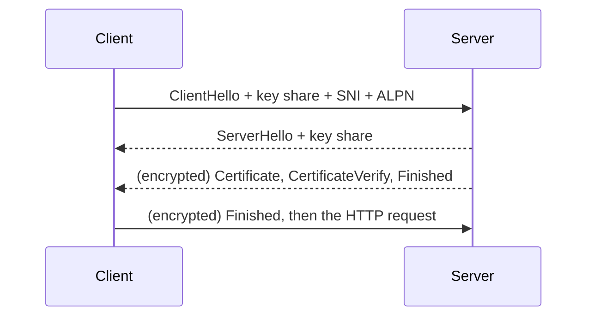

<p class="course">مهندسی اینترنت، فصل ۱: پروتکل‌ها</p>

# زیر HTTP: اتصال و TLS

<p class="lede">جلسهٔ ۴: چرا HTTP سه نسخه دارد، و TLS دقیقاً از چه چیزی محافظت می‌کند؟</p>

<Chain :today="['conn', 'tls']" />

<p class="byline">محمد بصیرزاده<br>دانشگاه شهید چمران اهواز، دانشکدهٔ مهندسی، پاییز ۱۴۰۵</p>

---
type: interactive
module: M0
minutes: 3
link: conn
corner: نگاهی از دور
---

# روی شبکهٔ همراهِ بد، کدام سریع‌تر است: HTTP/1.1 یا HTTP/2؟

صفحه‌ای با ده‌ها فایل کوچک، روی شبکه‌ای که از هر صد بسته دو تا را گم می‌کند.

<ol class="options">
  <li><b>الف)</b> همیشه HTTP/2</li>
  <li v-mark.box.orange="1"><b>ب)</b> اغلب HTTP/1.1</li>
  <li><b>ج)</b> فرقی ندارند</li>
  <li><b>د)</b> بسته به TLS</li>
</ol>

<div v-click="1" class="answer"><strong>پاسخ: ب)</strong> با ۲ درصد گم‌شدن بسته، آزمایش‌ها نشان داده‌اند کاربر HTTP/1.1 اغلب وضع بهتری دارد (<a href="https://github.com/bagder/http3-explained/blob/master/en/why-tcphol.md">HTTP/3 explained</a>). چرا نسخهٔ تازه‌تر می‌بازد؟ دلیلش در بخش ۲ و راه‌حلش در بخش ۳.</div>

::punch::

<div v-click="1">نسخهٔ تازه‌تر همیشه سریع‌تر نیست؛ باید بدانیم زیر HTTP چه می‌گذرد.</div>

---
module: M0
minutes: 2
link: conn
corner: نگاهی از دور
---

# نگاهی از دور: یک معنا، سه پشته

<Stack />

- در جلسهٔ ۲ گفتیم معنای HTTP ثابت است و [قالب انتقال]{.mark} عوض می‌شود؛ امروز همین قالب‌ها و لایه‌های زیرشان را بررسی می‌کنیم

::punch::

سه نسخهٔ HTTP یک حرف را می‌زنند؛ فرقشان در این است که بایت‌ها را چطور می‌برند.

---
layout: section
type: section
module: M1
minutes: 0
link: conn
---

# هر اتصال، یک صف: TCP و HTTP/1.1

<p class="since">در جلسهٔ ۲ پیام HTTP را دیدیم و گفتیم «روی یک اتصال» فرستاده می‌شود.</p>

<p class="question">باز کردن یک اتصال چقدر خرج دارد، و روی آن چند درخواست هم‌زمان جا می‌شود؟</p>

---
module: M1
minutes: 2
link: conn
corner: اتصال
---

# باز کردن یک اتصال چند رفت‌وبرگشت خرج دارد؟

<Rtt :show="['tls12', 'tls13']" />

- هر خانه یک رفت‌وبرگشت است ([RTT](https://en.wikipedia.org/wiki/Round-trip_delay)): زمانی که یک بسته برود و جوابش برگردد؛ تا سروری دور، به‌راحتی ۱۰۰ میلی‌ثانیه
- handshake در TCP یک رفت‌وبرگشت است و در TLS 1.3 یکی دیگر: [دو رفت‌وبرگشت پیش از اولین درخواست]{.mark}

::punch::

اتصال گران است؛ داستان امروز دربارهٔ کم باز کردن و خوب استفاده کردن از آن است.

---
module: M1
minutes: 2
link: conn
corner: HTTP/1.1
---

# روی یک اتصال HTTP/1.1 چند درخواست هم‌زمان جا می‌شود؟

- یکی. اتصال باز می‌ماند و دوباره به کار می‌رود، ولی هر پاسخ باید [کامل تمام شود]{.mark} تا بعدی شروع شود
- فرستادن چند درخواست پشت‌سرهم (pipelining) در مشخصات بود؛ ولی یک پاسخ کُند همهٔ بعدی‌ها را نگه می‌داشت و proxyهای معیوب خرابش می‌کردند. مرورگرها خاموشش کردند
- راه مرورگرها: تا [شش اتصال](https://developer.mozilla.org/en-US/docs/Web/HTTP/Guides/Connection_management_in_HTTP_1.x) هم‌زمان به هر دامنه

::punch::

در HTTP/1.1 هم‌زمانی یعنی اتصال بیشتر، و هر اتصال handshake خودش را می‌خواهد.

---
type: interactive
module: M1
minutes: 3
link: conn
corner: HTTP/1.1
---

# شصت فایل، شش اتصال: صفحه کِی کامل می‌شود؟

صفحه ۶۰ فایل کوچک دارد، هر رفت‌وبرگشت ۱۰۰ میلی‌ثانیه است و مرورگر ۶ اتصال HTTP/1.1 باز کرده است.

<ol class="options">
  <li><b>الف)</b> ۱۰۰ میلی‌ثانیه</li>
  <li><b>ب)</b> ۶۰۰ میلی‌ثانیه</li>
  <li v-mark.box.orange="1"><b>ج)</b> حدود ۱ ثانیه</li>
  <li><b>د)</b> ۶ ثانیه</li>
</ol>

<div v-click="1" class="answer"><strong>پاسخ: ج)</strong> هر اتصال در هر رفت‌وبرگشت یک فایل می‌آورد: ۶۰ فایل روی ۶ اتصال یعنی ۱۰ نوبت، یعنی ۱ ثانیه؛ تازه بعد از handshake هر شش اتصال. اگر همه هم‌زمان روی یک اتصال می‌رفتند، یک نوبت کافی بود.</div>

::punch::

<div v-click="1">گلوگاه HTTP/1.1 پهنای باند نیست؛ صف است.</div>

---
type: demo
module: M1
minutes: 6
link: conn
corner: HTTP/1.1
lab: 04-connection-tls/mux
status: executed
---

# یک اتصال، شش درخواست: چقدر طول می‌کشد؟

<dl class="run">
  <dt>سؤال</dt><dd>شش درخواست ۳۰۰ میلی‌ثانیه‌ای روی یک اتصال HTTP/1.1، روی شش اتصال، و روی یک اتصال HTTP/2 چقدر طول می‌کشد؟</dd>
  <dt>مشاهده</dt><dd>زمان کل؛ و در لاگ سرور، شمارهٔ اتصال و جریان هر درخواست</dd>
  <dt>تصمیم</dt><dd>برای صفحه‌ای با فایل‌های زیاد، HTTP/2 را روشن کن</dd>
</dl>

```sh
U1='http://127.0.0.1:8782/slow?i=[1-6]'; U2='http://127.0.0.1:8781/slow?i=[1-6]'
time curl -s -o /dev/null    --http1.1 "$U1"
time curl -s -o /dev/null -Z --http1.1 "$U1"
time curl -s -o /dev/null -Z --http2-prior-knowledge "$U2"
```

<p class="status">سرور محلی در <code>labs/04-connection-tls/mux</code>. گزینهٔ <code>-Z</code> یعنی درخواست‌ها را موازی بفرست.</p>

---
type: reserve
module: M1
minutes: 0
link: conn
corner: HTTP/1.1
---

# خروجی دمو: شش درخواست در سه حالت

| حالت | زمان کل | سرور چه دید |
| --- | --- | --- |
| HTTP/1.1 روی یک اتصال | ۱۸۲۹ میلی‌ثانیه | شش درخواست پشت‌سرهم روی اتصال ۱ |
| HTTP/1.1 با `-Z` | ۳۱۱ میلی‌ثانیه | [شش اتصال TCP جدا]{.mark} |
| HTTP/2 با `-Z` | ۳۱۲ میلی‌ثانیه | یک اتصال؛ جریان‌های ۱ و ۳ و ۵ و ۷ و ۹ و ۱۱ |

- جریان‌هایی که کلاینت باز می‌کند شمارهٔ فرد می‌گیرند
- روی loopback هزینهٔ handshake تقریباً صفر است؛ در شبکهٔ واقعی شش اتصال یعنی شش handshake برای TCP و شش تا برای TLS

---
layout: section
type: section
module: M2
minutes: 0
link: conn
---

# چند جریان روی یک اتصال: HTTP/2

<p class="since">در HTTP/1.1 هر اتصال در هر لحظه فقط یک پاسخ می‌برد.</p>

<p class="question">چطور ده‌ها درخواست را هم‌زمان روی یک اتصال ببریم، و بهایش چیست؟</p>

---
module: M2
minutes: 2
link: conn
corner: HTTP/2
---

# HTTP/2 صف را چطور از روی اتصال برداشت؟

- هر پیام به [frame](https://www.rfc-editor.org/rfc/rfc9113#section-4)‌های کوچک باینری خرد می‌شود و هر frame شمارهٔ جریان (stream) خودش را دارد؛ frame‌های جریان‌های مختلف [لابه‌لای هم]{.mark} می‌روند
- یک اتصال، یک handshake، ده‌ها درخواست هم‌زمان
- header‌های تکراری مثل `Cookie` و `User-Agent` فشرده می‌شوند: بار دوم فقط یک شماره می‌رود (HPACK)

::punch::

HTTP/2 معنا را عوض نکرد؛ یاد گرفت چند گفتگو را روی یک اتصال در هم ببافد.

---
type: interactive
module: M2
minutes: 3
link: conn
corner: HTTP/2
---

# یک بسته از جریان B گم شد؛ جریان‌های A و C چه می‌شوند؟

سه جریان روی یک اتصال HTTP/2 در حال دانلودند. یک بستهٔ TCP که تکه‌ای از B را می‌برد در راه گم می‌شود.

<ol class="options">
  <li><b>الف)</b> ادامه می‌دهند</li>
  <li v-mark.box.orange="1"><b>ب)</b> منتظر می‌مانند</li>
  <li><b>ج)</b> لغو می‌شوند</li>
  <li><b>د)</b> اتصال تازه می‌گیرند</li>
</ol>

<div v-click="1" class="answer"><strong>پاسخ: ب)</strong> بسته‌های A و C سالم رسیده‌اند، ولی TCP بایت‌ها را فقط به ترتیب تحویل می‌دهد: تا جای خالی پر نشود، چیزی به HTTP/2 نمی‌رسد. این همان دلیل پاسخ سؤال اول جلسه است.</div>

::punch::

<div v-click="1">برای TCP فقط یک رشته بایت وجود دارد؛ جریان‌های شما را نمی‌بیند.</div>

---
module: M2
minutes: 2
link: conn
corner: HTTP/2
---

# یک بستهٔ گم‌شده چه چیزهایی را نگه می‌دارد؟

<Hol :show="['h1', 'h2']" />

::punch::

HTTP/2 صف را از لایهٔ HTTP برداشت، ولی صف TCP زیر پایش ماند.

---
module: M2
minutes: 2
link: conn
corner: HTTP/2
---

# ترفندهای دوران HTTP/1.1 امروز چه می‌کنند؟

| ترفند | چرا ساخته شد | با HTTP/2 |
| --- | --- | --- |
| پخش فایل‌ها روی چند زیردامنه | شش اتصال به ازای هر دامنه | [ضرر]{.mark}: اتصال و handshake اضافه |
| یکی کردن همهٔ اسکریپت‌ها در یک فایل | درخواست کمتر | تغییر یک خط، کل فایل را از cache می‌اندازد |
| جاسازی تصویر و CSS درون HTML | حذف یک رفت‌وبرگشت | با هر صفحه دوباره فرستاده می‌شود |

::punch::

بهینه‌سازی دیروز، بدهی امروز است؛ هر ترفند را با نسخه‌ای بسنجید که واقعاً سرو می‌کنید.

---
module: M2
minutes: 2
link: conn
corner: HTTP/2
---

# سناریوی واقعی: قابلیتی که سرور بی‌پرسش می‌فرستاد

- در HTTP/2 سرور می‌توانست پیش از درخواست مرورگر، فایل بفرستد (Server Push)
- مشکل: سرور نمی‌داند [در cache مرورگر چه هست]{.mark}، و چیزی را می‌فرستاد که مرورگر داشت
- استفاده‌اش از ۱٫۲۵ به ۰٫۷ درصد سایت‌های HTTP/2 رسید و Chrome 106 در ۱۴۰۱ [خاموشش کرد](https://developer.chrome.com/blog/removing-push)؛ جانشین: `103 Early Hints` (جلسهٔ ۲)

::punch::

راهنمایی کردن کلاینت بهتر از تصمیم گرفتن به‌جای اوست؛ فقط کلاینت می‌داند چه دارد.

---
module: M2
minutes: 2
link: conn
corner: HTTP/2
---

# سناریوی واقعی: لغو درخواست، به‌عنوان سلاح

- در HTTP/2 کلاینت هر جریان را با یک frame کوچک `RST_STREAM` لغو می‌کند
- مهر ۱۴۰۲، حملهٔ Rapid Reset: مهاجم جریان باز می‌کرد و [بی‌درنگ لغوش می‌کرد]{.mark}. سقف جریان‌های هم‌زمان هرگز پر نمی‌شد، ولی سرور برای هر کدام کار کرده بود؛ اوج حمله ۳۹۸ میلیون درخواست در ثانیه ([Google](https://cloud.google.com/blog/products/identity-security/how-it-works-the-novel-http2-rapid-reset-ddos-attack/))
- مرداد ۱۴۰۴، [MadeYouReset](https://thehackernews.com/2025/08/new-http2-madeyoureset-vulnerability.html): همان اثر، با وادار کردن خودِ سرور به لغو

::punch::

قابلیتی که برای کلاینت ارزان و برای سرور گران باشد، دیر یا زود سلاح می‌شود.

---
layout: section
type: section
module: M3
minutes: 0
link: conn
---

# لایهٔ انتقال از نو: QUIC و HTTP/3

<p class="since">HTTP/2 صف را از لایهٔ HTTP برداشت، ولی صف TCP ماند.</p>

<p class="question">چطور لایهٔ انتقال را عوض کنیم، وقتی تجهیزات میان راه فقط TCP و UDP را رد می‌کنند؟</p>

---
module: M3
minutes: 2
link: conn
corner: QUIC
---

# QUIC صف را از لایهٔ انتقال چطور برداشت؟

<Hol :show="['h2', 'h3']" />

- [QUIC](https://www.rfc-editor.org/rfc/rfc9000) جریان‌ها را [در خود لایهٔ انتقال]{.mark} می‌شناسد و روی UDP سوار است تا از تجهیزات میان راه رد شود (جلسهٔ صفر)

::punch::

کاری را که HTTP/2 روی TCP نتوانست، QUIC یک لایه پایین‌تر انجام داد.

---
module: M3
minutes: 2
link: conn
corner: QUIC
---

# یک handshake به‌جای دو تا

<Rtt :show="['tls13', 'quic', '0rtt']" />

- در QUIC اتصال و رمزنگاری [با هم]{.mark} برقرار می‌شوند؛ TLS 1.3 جزئی از خود پروتکل است ([RFC 9001](https://www.rfc-editor.org/rfc/rfc9001))
- کلاینتی که قبلاً وصل شده، می‌تواند درخواست را همراه اولین بسته بفرستد؛ شرطش در بخش ۴

::punch::

هر رفت‌وبرگشتی که حذف شود، برای کاربرِ دور از سرور بیشترین فرق را می‌سازد.

---
type: interactive
module: M3
minutes: 3
link: conn
corner: QUIC
---

# از Wi-Fi خوابگاه به شبکهٔ همراه می‌روید؛ دانلود چه می‌شود؟

نشانی IP گوشی عوض شد. یک دانلود روی HTTP/2 در جریان بود و یکی روی HTTP/3.

<ol class="options">
  <li><b>الف)</b> هر دو قطع می‌شوند</li>
  <li v-mark.box.orange="1"><b>ب)</b> فقط HTTP/2 قطع می‌شود</li>
  <li><b>ج)</b> فقط HTTP/3 قطع می‌شود</li>
  <li><b>د)</b> هیچ‌کدام</li>
</ol>

<div v-click="1" class="answer"><strong>پاسخ: ب)</strong> اتصال TCP با نشانی IP و پورت دو طرف شناخته می‌شود؛ با عوض شدن IP، آن اتصال دیگر وجود ندارد. اتصال QUIC یک شناسه دارد (connection ID) و می‌تواند با نشانی تازه ادامه پیدا کند (<a href="https://www.rfc-editor.org/rfc/rfc9000#section-9">RFC 9000 §9</a>).</div>

::punch::

<div v-click="1">اتصال QUIC به یک شناسه گره خورده، نه به نشانی IP.</div>

---
module: M3
minutes: 2
link: conn
corner: HTTP/3
---

# مرورگر از کجا بداند سرور HTTP/3 دارد؟

<div class="cols">
<div>

- بار اول مرورگر با TCP می‌آید؛ سرور در پاسخ می‌گوید همین سرویس روی QUIC هم هست: `alt-svc: h3=":443"` ([RFC 7838](https://www.rfc-editor.org/rfc/rfc7838))
- یا پیش از اتصال، از رکورد HTTPS در DNS (جلسهٔ ۱)
- اگر UDP در شبکه بسته یا کُند باشد، مرورگر [بی‌صدا به HTTP/2 برمی‌گردد]{.mark}

</div>
<Shot src="images/devtools-protocol.png" alt="ستون Protocol در زبانهٔ Network با ردیف‌های h2 و h3" how="در Chrome زبانهٔ Network را در DevTools باز کنید؛ روی سرستون‌ها راست‌کلیک کنید و Protocol را روشن کنید. سایتی با HTTP/3 را دو بار بار کنید تا h2 و h3 هر دو دیده شوند." h="270" />
</div>

::punch::

HTTP/3 یک ارتقای اختیاری است؛ HTTP/2 همیشه باید پشتش آماده باشد.

---
module: M3
minutes: 2
link: conn
corner: HTTP/3
---

# HTTP/3 را چه سهمی از وب واقعاً به کار می‌برد؟

| سنجه | مقدار | منبع |
| --- | --- | --- |
| سایت‌هایی که HTTP/3 را اعلام می‌کنند | ۴۰٫۸ درصد | [W3Techs](https://w3techs.com/technologies/details/ce-http3)، مهر ۱۴۰۵ |
| درخواست‌هایی که با HTTP/3 می‌رسند | [حدود ۲۰ درصد]{.mark} | دادهٔ [Cloudflare Radar](https://technologychecker.io/blog/http-protocol-adoption)، تابستان ۱۴۰۵ |
| درخواست‌های HTTP/2 و HTTP/1.x | حدود ۵۲ و ۲۷ درصد | همان |

- فاصلهٔ دو عدد اول: بات‌ها و کتابخانه‌های HTTP هنوز بیشتر HTTP/1.1 حرف می‌زنند، و UDP همه‌جا باز نیست

::punch::

«پشتیبانی می‌کنیم» با «استفاده می‌شود» فرق دارد؛ تصمیم را با عدد دوم بگیرید.

---
module: M3
minutes: 2
link: conn
corner: HTTP/3
---

# تصمیم: HTTP/3 را کِی فعال کنیم؟

| سرویس | سود | چرا |
| --- | --- | --- |
| سایت یا برنامه با کاربر موبایل روی شبکهٔ پرنوسان | [زیاد]{.mark} | صف مشترک ندارد؛ با عوض شدن شبکه قطع نمی‌شود |
| کاربران دور از سرور | زیاد | یک رفت‌وبرگشت کمتر در هر اتصال تازه |
| API میان دو سرور در یک مرکز داده | ناچیز | گم‌شدن بسته و RTT هر دو نزدیک صفر است |

- هزینه: باز کردن پورت UDP 443، بار پردازشی بیشتر، و ابزار عیب‌یابی کمتر

::punch::

HTTP/3 برای شبکهٔ بد ساخته شده؛ هرچه کاربر دورتر و شبکه‌اش بدتر، سودش بیشتر.

---
layout: section
type: section
module: M4
minutes: 0
link: tls
---

# TLS از نزدیک

<p class="since">در جلسهٔ ۱ سه قول TLS را دیدیم: محرمانگی، یکپارچگی، اصالت سرور.</p>

<p class="question">این سه قول در یک رفت‌وبرگشت چطور ساخته می‌شوند، و هر کدام به چه چیزی تکیه دارد؟</p>

---
module: M4
minutes: 2
link: tls
corner: TLS
---

# در یک رفت‌وبرگشت TLS 1.3 چه رد و بدل می‌شود؟



- [سه کار](https://www.rfc-editor.org/rfc/rfc8446) در [یک رفت‌وبرگشت]{.mark}: ساختن کلید مشترک، اثبات هویت سرور، تأیید دست‌نخوردگی گفتگو

::punch::

بعد از ServerHello همه‌چیز رمز است، حتی گواهی سرور.

---
module: M4
minutes: 2
link: tls
corner: TLS
---

# کلید مشترک چطور ساخته می‌شود، وقتی همه گوش می‌دهند؟

- هر طرف برای همین اتصال یک جفت کلید [یک‌بارمصرف]{.mark} می‌سازد و نیمهٔ عمومی‌اش را می‌فرستد (key share)
- هر دو، از نیمهٔ خصوصی خودشان و نیمهٔ عمومی طرف مقابل، به یک راز می‌رسند که شنونده نمی‌تواند حسابش کند ([Diffie–Hellman](https://en.wikipedia.org/wiki/Diffie%E2%80%93Hellman_key_exchange))
- از ۱۴۰۳ مرورگرها یک سهم مقاوم در برابر رایانهٔ کوانتومی هم می‌فرستند؛ در آذر ۱۴۰۴ بیش از نیمی از ترافیک انسانی Cloudflare چنین بود ([Radar](https://blog.cloudflare.com/radar-2025-year-in-review/))

::punch::

کلید هر اتصال همان‌جا ساخته و همان‌جا دور ریخته می‌شود؛ کلید گواهی فقط امضا می‌کند.

---
type: interactive
module: M4
minutes: 3
link: tls
corner: TLS
---

# کلید خصوصی سرور لو رفت؛ ترافیک ضبط‌شدهٔ پارسال چه می‌شود؟

مهاجمی یک سال ترافیک TLS 1.3 سایت شما را ضبط کرده و امروز کلید خصوصی گواهی را دزدیده است.

<ol class="options">
  <li><b>الف)</b> همه باز می‌شود</li>
  <li v-mark.box.orange="1"><b>ب)</b> باز نمی‌شود</li>
  <li><b>ج)</b> فقط header‌ها</li>
  <li><b>د)</b> فقط کوکی‌ها</li>
</ol>

<div v-click="1" class="answer"><strong>پاسخ: ب)</strong> کلید هر اتصال از سهم‌های یک‌بارمصرف ساخته شده بود و دیگر وجود ندارد. نام این ویژگی <a href="https://en.wikipedia.org/wiki/Forward_secrecy">forward secrecy</a> است. ولی از امروز مهاجم می‌تواند خودش را جای سرور جا بزند، تا وقتی گواهی باطل یا منقضی شود.</div>

::punch::

<div v-click="1">دزدیدن کلید گواهی آینده را به خطر می‌اندازد، نه گذشته را.</div>

---
module: M4
minutes: 2
link: tls
corner: گواهی
---

# چه کسی می‌گوید این کلید مال این نام است؟

<ol class="steps">
  <li><span class="k">سرور</span><span>گواهی <code>shop.example</code>: نام و کلید عمومی، با امضای CA میانی</span><span class="tag">در handshake</span></li>
  <li><span class="k">CA میانی</span><span>گواهی خودش، با امضای CA ریشه</span><span class="tag">در handshake</span></li>
  <li><span class="k">CA ریشه</span><span>از پیش در مرورگر یا سیستم‌عامل</span><span class="tag out">در دستگاه شما</span></li>
</ol>

- مرورگر می‌سنجد: نام گواهی با نام URL یکی است؟ تاریخ اعتبار؟ زنجیرهٔ امضا به یک ریشهٔ مورداعتماد می‌رسد؟ و با `CertificateVerify`، سرور [کلید خصوصی همین گواهی را دارد]{.mark}؟

::punch::

گواهی یک ادعای امضاشده است: «این کلید مال این نام است»؛ اعتبارش به امضاکننده است.

---
type: interactive
module: M4
minutes: 3
link: tls
corner: گواهی
---

# یک CA بی‌اجازهٔ بانک برایش گواهی صادر کرد؛ مرورگر چه می‌کند؟

بانک گواهی‌اش را همیشه از CA الف می‌گیرد. CA دیگری، که آن هم در فهرست اعتماد مرورگر است، برای `bank.example` گواهی صادر می‌کند.

<ol class="options">
  <li><b>الف)</b> رد می‌کند</li>
  <li v-mark.box.orange="1"><b>ب)</b> می‌پذیرد</li>
  <li><b>ج)</b> از بانک می‌پرسد</li>
  <li><b>د)</b> هشدار می‌دهد</li>
</ol>

<div v-click="1" class="answer"><strong>پاسخ: ب)</strong> مرورگر نمی‌داند بانک کدام CA را انتخاب کرده است؛ هر گواهی که زنجیره‌اش به یکی از ده‌ها ریشهٔ مورداعتماد برسد، برای هر نامی پذیرفته می‌شود.</div>

::punch::

<div v-click="1">هر CA می‌تواند برای هر نامی گواهی بدهد؛ امنیت همه به ضعیف‌ترینشان بسته است.</div>

---
module: M4
minutes: 2
link: tls
corner: گواهی
---

# سناریوی واقعی: گواهی‌ای که Google نگرفته بود

- تابستان ۱۳۹۰: به DigiNotar، یک CA هلندی، نفوذ شد و برای `*.google.com` گواهی صادر شد
- گزارش Fox-IT: حدود ۳۰۰ هزار نشانی IP با این گواهی به Google وصل شدند، [بیش از ۹۹ درصد از ایران]{.mark} ([Computerworld](https://www.computerworld.com/article/1434814/nearly-300-000-iranian-ip-addresses-likely-compromised.html))
- DigiNotar از فهرست اعتماد همهٔ مرورگرها حذف شد
- پیامد ماندگار: [Certificate Transparency](https://certificate.transparency.dev/)؛ هر گواهی باید در دفترهای عمومی ثبت شود تا صاحب دامنه صدور بی‌اجازه را ببیند

::punch::

اعتماد به CA قابل‌راستی‌آزمایی نبود؛ دفتر عمومی آن را قابل‌دیدن کرد.

---
module: M4
minutes: 2
link: tls
corner: گواهی
---

# عمر گواهی چرا مدام کوتاه‌تر می‌شود؟

- باطل کردن گواهیِ لو رفته در عمل خوب کار نمی‌کند: مرورگرها وضعیت ابطال را کامل نمی‌پرسند و Let's Encrypt در ۱۴۰۴ سرویس OCSP را [بست](https://www.abetterinternet.org/post/ending-ocsp)
- پس عمر را کوتاه می‌کنند: سقف از ۳۹۸ روز به [۲۰۰ روز]{.mark} از اسفند ۱۴۰۴، ۱۰۰ روز از اسفند ۱۴۰۵ و ۴۷ روز از اسفند ۱۴۰۷ ([Sectigo](https://sectigostore.com/blog/47-day-ssl-certificate-validity/))
- Let's Encrypt از دی ۱۴۰۴ گواهی [شش‌روزه](https://www.feistyduck.com/newsletter/issue_133_lets_encrypts_six_day_certificates_generally_available) هم می‌دهد

::punch::

گواهی‌ای که دستی تمدید شود، دیر یا زود منقضی می‌شود؛ تمدید را خودکار کنید.

---
type: demo
module: M4
minutes: 6
link: tls
corner: TLS
lab: 04-connection-tls/tls
status: executed
---

# یک handshake واقعی را بخوانیم

<dl class="run">
  <dt>سؤال</dt><dd>در handshake با سرور خودمان چه چیزهایی توافق و چه چیزهایی بررسی می‌شود؟</dd>
  <dt>مشاهده</dt><dd>نسخه، روش تبادل کلید، ALPN و زنجیرهٔ گواهی؛ و خطای curl وقتی CA را نمی‌شناسد</dd>
  <dt>تصمیم</dt><dd>خطای گواهی را با <code>-k</code> خاموش نکن؛ علتش را پیدا کن</dd>
</dl>

```sh
sh tls/make-certs.sh && node tls/server.mjs
R='--resolve shop.test:8443:127.0.0.1'
curl -sv $R --cacert tls/certs/ca.pem https://shop.test:8443/
curl -sS $R https://shop.test:8443/
```

<p class="status">کد در <code>labs/04-connection-tls/tls</code>. این CA آزمایشی است؛ آن را به فهرست اعتماد سیستم اضافه نکنید.</p>

---
type: reserve
module: M4
minutes: 0
link: tls
corner: TLS
---

# خروجی دمو: curl در handshake چه دید؟

```text
* TLSv1.3 (OUT), TLS handshake, Client hello (1):
* TLSv1.3 (IN), TLS handshake, Server hello (2):
* TLSv1.3 (IN), TLS handshake, Certificate (11):
* TLSv1.3 (IN), TLS handshake, CERT verify (15):
* SSL connection using TLSv1.3 / TLS_AES_256_GCM_SHA384 / X25519
* ALPN: server accepted h2
*  subjectAltName: host "shop.test" matched cert's "shop.test"
*  SSL certificate verify ok.
```

| حالت | خطای curl |
| --- | --- |
| بدون `--cacert` | `(60) unable to get local issuer certificate` |
| همان سرور با نام `bank.test` | `(60) no alternative certificate subject name matches` |

---
module: M4
minutes: 2
link: tls
corner: TLS
---

# ناظر شبکه از یک اتصال TLS 1.3 هنوز چه می‌بیند؟

- پیام ClientHello رمز نیست: نام سرور (SNI)، فهرست پروتکل‌ها (ALPN) و فهرست الگوریتم‌هایی که کلاینت بلد است
- [ECH](https://www.rfc-editor.org/rfc/rfc9849)، که در اسفند ۱۴۰۴ استاندارد شد، ClientHello واقعی را با کلیدی که سرور در DNS گذاشته رمز می‌کند
- گواهی سرور، مسیر، header‌ها و کوکی [دیده نمی‌شوند]{.mark}؛ اندازه و زمان‌بندی بسته‌ها دیده می‌شوند

::punch::

TLS 1.3 تقریباً همه‌چیز را پنهان می‌کند، جز اینکه با چه کسی و با چه نرم‌افزاری حرف می‌زنید.

---
module: M4
minutes: 2
link: tls
corner: هوش مصنوعی
---

# پیوند با هوش مصنوعی: سرور از کجا می‌فهمد شما مرورگر نیستید؟

- ترتیب و فهرست الگوریتم‌ها در ClientHello برای هر کتابخانهٔ TLS فرق دارد؛ از آن یک [اثر انگشت]{.mark} مثل [JA4](https://github.com/FoxIO-LLC/ja4) ساخته می‌شود
- اسکریپت Python با `User-Agent` مرورگر Chrome، باز هم ClientHello کتابخانهٔ Python را می‌فرستد؛ سامانه‌های ضدبات همین ناهمخوانی را می‌گیرند ([Cloudflare](https://developers.cloudflare.com/bots/concepts/ja3-ja4-fingerprint))
- خزنده‌ها و agentهای هوش مصنوعی هم با همین روش شناخته می‌شوند؛ راه درست‌تر، هویت امضاشده است (جلسهٔ ۷)

::punch::

`User-Agent` ادعاست؛ ClientHello رفتار است، و جعل رفتار سخت‌تر است.

---
module: M4
minutes: 2
link: tls
corner: TLS
---

# سریع‌ترین درخواست، با یک شرط

- در `0-RTT` کلاینتی که قبلاً وصل شده، درخواست را [همراه اولین بسته]{.mark} می‌فرستد؛ پیش از تمام شدن handshake
- ولی شنونده می‌تواند همان بسته را ضبط و دوباره ارسال کند، و سرور دو بار اجرایش می‌کند
- پس `0-RTT` فقط برای درخواستی که تکرارش بی‌خطر است (جلسهٔ ۲)؛ سرور برای بقیه `425 Too Early` می‌دهد ([RFC 8470](https://www.rfc-editor.org/rfc/rfc8470))

::punch::

هر میان‌بُر در handshake بهایی دارد؛ اینجا بها «شاید دو بار اجرا شود» است.

---
layout: section
type: section
module: M5
minutes: 0
link: all
---

# جمع‌بندی

<p class="since">اتصال و سه نسخهٔ HTTP را بررسی کردیم، و بعد QUIC و TLS را.</p>

<p class="question">یک بازدید تازه، تا رسیدن اولین بایت پاسخ، چند رفت‌وبرگشت خرج دارد؟</p>

---
type: interactive
module: M5
minutes: 3
link: all
corner: جمع‌بندی
---

# چند رفت‌وبرگشت تا اولین بایت پاسخ؟

کاربری برای اولین بار `https://lms.scu.ac.ir` را باز می‌کند. DNS جواب داده و سرور HTTP/2 و TLS 1.3 دارد.

<ol class="options">
  <li><b>الف)</b> یکی</li>
  <li><b>ب)</b> دوتا</li>
  <li v-mark.box.orange="1"><b>ج)</b> سه‌تا</li>
  <li><b>د)</b> چهارتا</li>
</ol>

<div v-click="1" class="answer"><strong>پاسخ: ج)</strong> TCP یکی، TLS 1.3 یکی، و خود درخواست و پاسخ یکی. با HTTP/3 دوتا می‌شود، و با <code>0-RTT</code> در بازدید بعدی یکی. با رفت‌وبرگشت ۱۰۰ میلی‌ثانیه‌ای، فرق ۳۰۰ و ۱۰۰ میلی‌ثانیه پیش از اولین بایت است.</div>

::punch::

<div v-click="1">هزینهٔ اتصال را با رفت‌وبرگشت بشمارید، نه با کیلوبایت.</div>

---
module: M5
minutes: 1
link: all
corner: جمع‌بندی
---

# چهار مدل ذهنی، چهار تصمیم

| مدل ذهنی | تصمیم مهندسی |
| --- | --- |
| در HTTP/1.1 هر اتصال یک صف است | HTTP/2 را روشن کن و ترفندهای قدیمی را بردار |
| HTTP/2 صف را از HTTP برداشت، نه از TCP | برای شبکهٔ بد، HTTP/3 با پشتیبان HTTP/2 |
| کلید هر اتصال یک‌بارمصرف است؛ گواهی فقط امضا می‌کند | تمدید خودکار؛ خطای گواهی را خاموش نکن |
| ClientHello و اندازه و زمان‌بندی دیده می‌شوند | `0-RTT` فقط برای درخواست بی‌خطر در تکرار |

::punch::

جلسهٔ بعد: اگر TLS لوله را امن می‌کند، CDN که وسط لوله نشسته چه می‌بیند؟

---
type: exercise
module: M5
minutes: 4
link: all
corner: تمرین
---

# تمرین ۴: TLS را با کلید خودتان باز کنید

<Exercise ex="04-open-tls" due="تا شب پیش از جلسهٔ ۵">
<dl class="run">
  <dt>چالش</dt><dd>برای سرور محلی خودتان CA و گواهی بسازید، اتصال را سه جور بشکنید و خطاها را بخوانید. بعد ترافیک را ضبط کنید و با کلید نشست خودتان بازش کنید.</dd>
  <dt>پیش‌بینی</dt><dd>همین حالا روی کاغذ: در ضبط یک اتصال TLS 1.3، <b>بدون کلید</b>، کدام‌ها دیده می‌شوند: نام سرور، گواهی سرور، مسیر URL، کوکی؟ چرا؟</dd>
  <dt>پل</dt><dd>شما با کلید نشست همه‌چیز را خواندید. CDN هم همین کلید را دارد؛ جلسهٔ ۵ از همین‌جا شروع می‌شود.</dd>
</dl>
</Exercise>

---
src: ../ch1-syllabus.md
type: core
module: M5
minutes: 1
---

---
type: extra
module: M5
minutes: 0
link: all
corner: جمع‌بندی
---

# برای کنجکاوی بیشتر (۱ از ۲)

<ol class="curious">
  <li>HTTP/2 بی‌رمز (h2c) در مشخصات هست؛ چرا هیچ مرورگری آن را پیاده نکرد؟<span class="hint">RFC 9113 بخش ۳؛ و رفتار تجهیزات میان راه با ترافیک بی‌رمزی که نمی‌شناسند.</span></li>
  <li>چرا HPACK به‌جای gzip ساخته شد؟<span class="hint">حملهٔ CRIME؛ ملاحظات امنیتی در RFC 7541.</span></li>
  <li>TCP Fast Open هم می‌خواست یک رفت‌وبرگشت کم کند؛ چرا همه‌گیر نشد؟<span class="hint">RFC 7413، و الگوی «هرچه پرکاربردتر، عوض کردنش سخت‌تر» از جلسهٔ صفر.</span></li>
</ol>

---
type: extra
module: M5
minutes: 0
link: all
corner: جمع‌بندی
---

# برای کنجکاوی بیشتر (۲ از ۲)

<ol class="curious" start="4" style="counter-reset: q 3">
  <li>اگر ناظر شبکه رکورد HTTPS را از پاسخ DNS حذف کند، بر سر ECH چه می‌آید؟<span class="hint">RFC 9460 و RFC 9849؛ و DNS رمزشده در جلسهٔ ۱.</span></li>
  <li>گواهی <code>*.scu.ac.ir</code> برای <code>a.b.scu.ac.ir</code> معتبر است؟<span class="hint">قاعدهٔ wildcard در RFC 9525؛ با <code>openssl s_client</code> روی سرور دموی کلاس امتحانش کنید.</span></li>
  <li>مرورگرها چرا هنوز متغیر <code>SSLKEYLOGFILE</code> را نگه داشته‌اند، با اینکه هر که آن فایل را بخواند ترافیک را باز می‌کند؟<span class="hint">تمرین ۴؛ و فرق «دسترسی به دستگاه» با «دسترسی به شبکه».</span></li>
</ol>

---
type: reserve
module: M5
minutes: 0
link: all
corner: منابع
---

# منابع

<ul class="src two">
  <li><a href="https://www.rfc-editor.org/rfc/rfc9113">RFC 9113: HTTP/2</a> · <a href="https://www.rfc-editor.org/rfc/rfc9114">RFC 9114: HTTP/3</a></li>
  <li><a href="https://www.rfc-editor.org/rfc/rfc9000">RFC 9000: QUIC</a> · <a href="https://www.rfc-editor.org/rfc/rfc9001">RFC 9001</a> · <a href="https://www.rfc-editor.org/rfc/rfc7838">RFC 7838</a></li>
  <li><a href="https://www.rfc-editor.org/rfc/rfc8446">RFC 8446: TLS 1.3</a> · <a href="https://www.rfc-editor.org/rfc/rfc8470">RFC 8470</a> · <a href="https://www.rfc-editor.org/rfc/rfc9849">RFC 9849: ECH</a></li>
  <li><a href="https://developer.mozilla.org/en-US/docs/Web/HTTP/Guides/Connection_management_in_HTTP_1.x">MDN: connection management</a></li>
  <li><a href="https://github.com/bagder/http3-explained/blob/master/en/why-tcphol.md">Stenberg: HTTP/3 explained</a></li>
  <li><a href="https://developer.chrome.com/blog/removing-push">Chrome: removing Server Push</a></li>
  <li><a href="https://cloud.google.com/blog/products/identity-security/how-it-works-the-novel-http2-rapid-reset-ddos-attack/">Google Cloud: Rapid Reset</a></li>
  <li><a href="https://thehackernews.com/2025/08/new-http2-madeyoureset-vulnerability.html">The Hacker News: MadeYouReset</a></li>
  <li><a href="https://w3techs.com/technologies/details/ce-http3">W3Techs: HTTP/3 usage</a> · <a href="https://technologychecker.io/blog/http-protocol-adoption">request share</a></li>
  <li><a href="https://blog.cloudflare.com/radar-2025-year-in-review/">Cloudflare Radar 2025</a></li>
  <li><a href="https://www.computerworld.com/article/1434814/nearly-300-000-iranian-ip-addresses-likely-compromised.html">Computerworld: DigiNotar and Fox-IT</a></li>
  <li><a href="https://certificate.transparency.dev/">Certificate Transparency</a></li>
  <li><a href="https://sectigostore.com/blog/47-day-ssl-certificate-validity/">Sectigo: 47-day certificates</a></li>
  <li><a href="https://www.feistyduck.com/newsletter/issue_133_lets_encrypts_six_day_certificates_generally_available">Feisty Duck: six-day certificates</a> · <a href="https://www.abetterinternet.org/post/ending-ocsp">OCSP</a></li>
  <li><a href="https://developers.cloudflare.com/bots/concepts/ja3-ja4-fingerprint">Cloudflare: JA3 and JA4</a> · <a href="https://github.com/FoxIO-LLC/ja4">FoxIO</a></li>
</ul>
